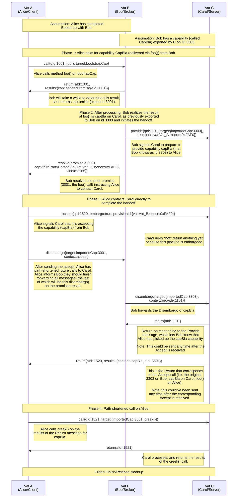

# md-CapNProto - A Go CapNProto Rewrite Experiment

This is an experiment on writing a new [CapNProto](https://capnproto.org) implementation from scratch in Go. The main goals are:

- Make it the best performing, generic RPC implementation available in Go.
- Make 3PH (three-party-handoff) possible to implement.

Both goals have been achieved in this experiment!

Secondary goals are:

- Make the client API more idiomatic.
- Make the internal RPC implementation easier to reason about.

These are ongoing. In particular, I'm not completely satisfied by the client API for defining RPC calls.


# Performance Characteristics

See [GoRPCBench](https://github.com/matheusd/gorpcbench) for performance benchmarks against other RPC frameworks.

At the serialization level, many experiments have been made trying to extract the maximum possible performance for marshalling and unmarshalling CapNProto structures. These mainly involved:

- Reducing the number of allocations.
- Improving "inlineability" of every call path.
- Removing redundant work performed on hot paths.
- Optimizing the references and read/write access to the underlying arena data slices.
- Ensuring framed serialization is "free" on properly allocated messages (no need to copy into a new buffer).

At the RPC level, the main knobs tuned are:

- Ensuring the API does not force memory allocations on callers.
- Providing ways to allocate messages only once during their building stage.
  - In particular: ensuring callers can provide hints on expected message sizes, which minimizes allocations to at most one per outbound message.
- Avoiding profuse Goroutine dispatching.
  - For standard (level 1+ clients and servers): Four per remote connection
    - Incoming Call messges are initially handled in the inbound loop Goroutine.
  - For level 0 clients: No additional goroutines
    - Call/Return pairs are processed in the calling goroutine directly.

# Three-Party Handoff Implementation

Three-Party Handoff (3PH for short) is a way of forwarding "capabilities" (i.e. callable functionality) shared between two vats (i.e. nodes) to a third one.

The goal, after the execution of a 3PH handoff, is for the third party vat to be able to use this shared capability directly, without having to proxy its calls through the prior intermediary; this is also called _path shortening_. This shared "capability" implicitly includes the security context of the original capability.

This experiment has successfully implemented the simplest 3PH protocol between 3 vats without pending proxied calls:

<details>
<summary>Sequence Diagram for simplest 3PH scenario</summary>

This is the simplest 3PH scenario where a capability from Carol initially held by Bob is shared to Alice, so that Alice can make a direct call.

## The Scenario

*   **Vat A (Alice/Client):** Our client. She wants to get a capability and immediately use it.
*   **Vat B (Bob/Intermediary):** A service that acts as a factory or broker. It doesn't host the final capability itself.
*   **Vat C (Carol/Server):** The service that actually owns and hosts the final resource.

Interface definitions:

```capnp
interface BobAPI { // Returned as Bob's Bootstrap()
    foo @1 () -> (capBla :CapBla);
}
interface CapBla {
    creek @1 (creekArg :Text) -> (creekResult :Text);
}
```

## Diagram



</details>


[Sample log for test 3PH execution](https://matheusd.github.io/mdcapnp/3ph-test.log.html).

[Test code for sample 3PH execution](https://github.com/matheusd/mdcapnp/blob/master/capnprpc/vat_3ph_test.go#L194).


# Current Status

This experiment has achieved its goal of proving it is possible to write a significantly better performing generic RPC system in Go, compared to the existing alternatives.

It has also demonstrated that using a simpler internal implementation it is possible to readily implement the 3PH protocol.

Several things are still missing before it is usable as a fully featured CapNProto implemetation though, including:

- Code genaration for client code.
- Export ability to resolve Calls with remote promises.
- Add abstraction for servers.
- Pack compression.
- Flow limits.
- Better abstraction for capabilities.

