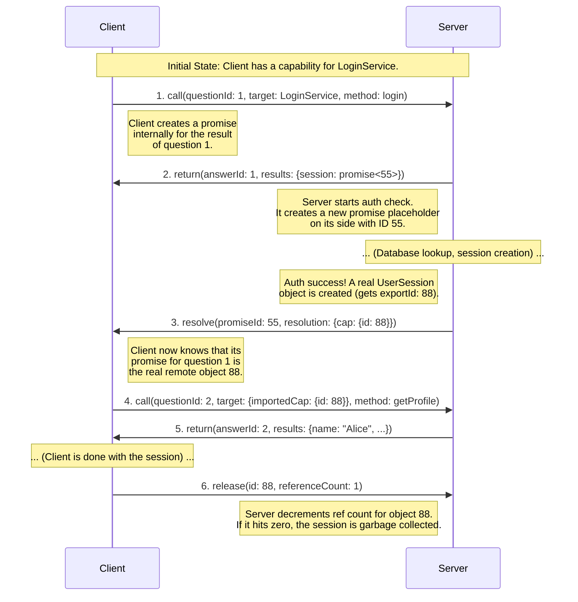

```mermaid
sequenceDiagram
    participant Vat_A as Vat A<br/> (Alice/Client)
    participant Vat_B as Vat B<br/> (Bob/Broker)
    participant Vat_C as Vat C<br/> (Carol/Server)

    Note over Vat_A, Vat_B: Assumption: Alice has completed <br/>Bootstrap with Bob.
    Note over Vat_B, Vat_C: Assumption: Bob has a capability (called <br/>capBla) exported by C on ID 3303.



    Note over Vat_A, Vat_C: Phase 1: Alice makes pipelined calls to Bob

    Vat_A->>Vat_B: call{qId:1001, foo(), target:bootstrapCap}
    Note right of Vat_A: Alice calls method foo() on bootrapCap.

    Vat_A->>Vat_B: call{qId:1002, bar(), target:{promisedAns:1001}}
    Note right of Vat_A: Alice pipelines method bar() on the result of foo().

    Vat_B->>Vat_A: return{aId:1001, <br/>results:{cap: senderPromise{eId:3001}}}
    Note left of Vat_B: Bob will take a while to determine this result, <br/>so it returns a promise (export id 3001).

    Vat_B->>Vat_A: return{aId:1002, <br/>results:{cap: senderPromise{eId:3002}}}
    Note left of Vat_B: Bob will take a while to determine this result, <br/>so it returns a promise (export id 3002).



    Note over Vat_A, Vat_C: Phase 2: After processing, Bob realizes the result<br/> of foo() is capBla on Carol, as previously exported<br/> to Bob on id 3303 and initiates the handoff.

    Vat_B->>Vat_C: provide{qId:1101, target:{importedCap:3303}, <br/>recipient:{vat:Vat_A, nonce:0xFAF0}}
    Note right of Vat_B: Bob signals Carol to prepare to <br/> provide capability capBla (that <br/>Bob knows as id 3303) to Alice.

    Vat_B->>Vat_C: call{qid:1102, bar(), target:{importedCap:3303}, <br/>sendResultsTo:{vat:Vat_A, nonce:0xFAF1}}
    Note right of Vat_B: Additionally, Bob forwards the call <br/>capBla.bar(), informing the results<br/> will go to Alice.

    Vat_C->>Vat_B:  return{aId:1102, resultsSentElsewhere}
    Note left of Vat_C: Carol confirms the results will be sent<br/> to Alice. They will be cached until<br/> the corresponding Accept.

    Vat_B->>Vat_A: resolve{promiseId:3001, <br/>cap:{thirdPartyHosted:{id:{vat:Vat_C, nonce:0xFAF0}, <br/>vineId:2105}}
    Note left of Vat_B: Bob resolves the prior promise <br/>(3001, the foo() call) instructing Alice<br/> to contact Carol.

    Vat_B->>Vat_A: resolve{promiseId:3002, <br/>cap:{thirdPartyHosted:{id:{vat:Vat_C, nonce:0xFAF1}, <br/>vineId:2106}}
    Note left of Vat_B: Bob resolves the prior promise <br/>(3002, the bar() call) instructing Alice<br/> to contact Carol.



    Note over Vat_A, Vat_C: Phase 3: Alice contacts Carol directly to <br/>complete the handoff.

    Vat_A->>Vat_C: accept{qId:1520, embargo:true, provisionId:{vat:Vat_B,nonce:0xFAF0}}
    Note right of Vat_A: Alice signals Carol that it is accepting <br/> the capability (capBla) from Bob
    Vat_A->>Vat_C: accept{qId:1521, embargo:true, provisionId:{vat:Vat_B,nonce:0xFAF1}}
    Note right of Vat_A: Alice signals Carol that it is accepting <br/> the results of capBla.bar() from Bob
    Note left of Vat_C: Carol does *not* return anything yet,<br/> because this pipeline is embargoed. <br/>API-wise, Alice has a promise to the <br/> result of this call (capBla.bar()).
    Vat_A->>Vat_B: disembargo{target:importedCap:3001,<br/> context.accept}    
    Vat_A->>Vat_B: disembargo{target:importedCap:3002,<br/> context.accept}
    Note right of Vat_A: After sending the accept, Alice has <br/> path-shortened future calls to Carol.<br/> Alice informs Bob they should finish <br/> forwarding all messages (the last<br/> of which will be these disembargos) <br/> on each promised result.
    Vat_C->>Vat_B: return{aId: 1101}    
    Note left of Vat_C: Return corresponding to the Provide<br/> message, which lets Bob know that<br/> Alice has picked up the capBla capability.


    Note over Vat_A, Vat_C: Phase 4: Pipelined call on Alice.

    Vat_A->>Vat_C: call{qId:1522, target:{promisedAns:1521, creek()}}
    Note right of Vat_A: Alice calls creek() on the promised <br/>results of the Accept message for<br/> capBla.bar().
    Note left of Vat_C: Carol has cached this call and not<br/> delivered to the handler yet (because <br/>context.embargo was set on Accept and<br/> she hasn't received the Disembargo yet).



    Note over Vat_A, Vat_C: Phase 5: Forwarding

    Vat_B->>Vat_C: disembargo{target:{importedCap:3303}, <br>context{provide:1101}}
    Note right of Vat_B: Bob forwards the Disembargo of capBla.

    

    Vat_B->>Vat_C: disembargo{target:{promisedAns:1102}, <br>context{provide:1102}}
    Note right of Vat_B: Bob forwards the Disembargo of <br/>capBla.bar() results.


    Note left of Vat_C: Carol is now certain to have seen all earlier <br/>messages and is free to start processing.<br/> In particular, she processes bar()<br/> immediately upon receipt and then creek()<br/> after receiving the Disembargo.



    Note over Vat_A, Vat_C: Phase 6: Concrete responses
    Vat_C->>Vat_A: return(aId: 1520, results: capBla)

    Note left of Vat_C: This is the Return that corresponds <br/>to the Accept call (i.e. the original<br/> 3303 on Bob, capBla on Carol, foo() <br/> on Alice).<br/><br/>Note: this could've been sent<br/>any time after the corresponding<br/> Accept.
    Vat_C->>Vat_A: return(aId: 1521)
    Note left of Vat_C: This is the Return that corresponds<br/> to the pipelined, forwarded foo().bar() call.<br/><br/>Note: this could've been sent<br/>any time after the corresponding<br/> Accept.
    Vat_C->>Vat_A: return(aId: 1522)
    Note left of Vat_C: This is the Return that corresponds<br/> to the path-shortened foo().bar().creek() call.<br/><br/>Note: this could only be sent<br/>after the last Disembargo.


    Note over Vat_A, Vat_C: Phase 7: Cleanup

    Vat_A->>Vat_C: finish(qId: 1522)
    Note right of Vat_A: This is the Finish message that <br>corresponds to the bar().creek() <br/>Call message.
    Vat_A->>Vat_C: finish(qId: 1521)
    Note right of Vat_A: This are the Finish messages that<br/>corresponds to the foo().bar() <br/>Accept message.
    Vat_A->>Vat_C: finish(qId: 1520)
    Note right of Vat_A: This is the Finish message that <br>corresponds to the foo() <br/>Accept message.
    
    Vat_A->>Vat_B: release(id: 3002)
    Note right of Vat_A: This releases the Resolve message that<br/> imported  the proxy cap (foo().bar()) from Bob.
    Vat_A->>Vat_B: release(id: 3001)
    Note right of Vat_A: This releases the Resolve message that<br/> imported  the proxy cap (foo()) from Bob.    

    Vat_B->>Vat_C:  finish(qId:1102)
    Note right of Vat_B: This is the Finish message that <br/> corresponds to the forwarded<br/> Call message.
    Vat_B->>Vat_C:  finish(qId:1101)
    Note right of Vat_B: This is the Finish message that <br/> corresponds to the Provide message.

    Vat_A->>Vat_B: finish(id: 1002)
    Note right of Vat_A: This is the Finish message that<br/> corresponds to the initial<br/> foo().bar() Call message.
    Vat_A->>Vat_B: finish(id: 1001)
    Note right of Vat_A: This is the Finish message that<br/> corresponds to the initial<br/> foo() Call message.

```

# Example promise sequence




# 3PH With Post-Accept Pipeline

This is the simplest 3PH scenario which requires a disembargo due to a pipelined call that will be sent after the `Accept` message but before the capability is returned.

## The Scenario

*   **Vat A (Alice/Client):** Our client. She wants to get a capability and immediately use it.
*   **Vat B (Bob/Intermediary):** A service that acts as a factory or broker. It doesn't host the final capability itself.
*   **Vat C (Carol/Server):** The service that actually owns and hosts the final resource.

## Diagram




```mermaid
sequenceDiagram
    participant Vat_A as Vat A<br/> (Alice/Client)
    participant Vat_B as Vat B<br/> (Bob/Broker)
    participant Vat_C as Vat C<br/> (Carol/Server)

    Note over Vat_A, Vat_B: Assumption: Alice has completed <br/>Bootstrap with Bob.
    Note over Vat_B, Vat_C: Assumption: Bob has a capability (called <br/>capBla) exported by C on ID 3303.



    Note over Vat_A, Vat_C: Phase 1: Alice gets a promise from Bob.
    Vat_A->>Vat_B: call{qId:1001, foo(), target:bootstrapCap}

    Note right of Vat_A: Alice calls method foo() on bootrapCap.

    Vat_B->>Vat_A: return{aId:1001, <br/>results:{cap: senderPromise{eId:3001}}}
    Note left of Vat_B: Bob will take a while to determine this result, <br/>so it returns a promise (export id 3001).



    Note over Vat_A, Vat_C: Phase 2: After processing, Bob realizes the result<br/> of foo() is capBla on Carol, as previously exported<br/> to Bob on id 3303 and initiates the handoff.

    Vat_B->>Vat_C: provide{qId:1101, target:3303, <br/>recipient:{vat:Vat_A, nonce:0xFAF0}}
    Note right of Vat_B: Bob signals Carol to prepare to <br/> provide capability capBla (that <br/>Bob knows as id 3303) to Alice.

    Vat_B->>Vat_A: resolve{promiseId:3001, <br/>cap:{thirdPartyHosted:{id:{vat:Vat_C, nonce:0xFAF0}, <br/>vineId:2105}}
    Note left of Vat_B: Bob resolves the prior promise <br/>(3001, the foo() call) instructing Alice<br/> to contact Carol.



    Note over Vat_A, Vat_C: Phase 3: Alice contacts Carol directly to <br/>complete the handoff.

    Vat_A->>Vat_C: accept{qId:1520, embargo:true, provisionId:{vat:Vat_B,nonce:0xFAF0}}
    Note right of Vat_A: Alice signals Carol that it is accepting <br/> the capability (capBla) from Bob
    Note left of Vat_C: Carol does *not* return anything yet,<br/> because this pipeline is embargoed. <br/>API-wise, Alice has a promise to the <br/> result of this call.
    Vat_A->>Vat_B: disembargo{target:importedCap:3001,<br/> context.accept}
    Note right of Vat_A: After sending the accept, Alice has <br/> path-shortened future calls to Carol.<br/> Alice informs Bob they should finish <br/> forwarding all messages (the last<br/> of which will be this disembargo).
    Vat_C->>Vat_B: return{aId: 1101}
    Note left of Vat_C: Return corresponding to the Provide<br/> message, which lets Bob know that<br/> Alice has picked up the capability.


    Note over Vat_A, Vat_C: Phase 4: Pipelined call on Alice.

    Vat_A->>Vat_C: call{qId:1521, target:{promisedAns:1520, bar()}}
    Note right of Vat_A: Alice calls bar() on the promised <br/>results of the Accept message.
    Note left of Vat_C: Carol has cached this call and not<br/> delivered to the handler yet (because <br/>context.embargo was set on Accept and<br/> she hasn't received the Disembargo yet).



    Note over Vat_A, Vat_C: Phase 5: Disembargo Forwarding

    Vat_B->>Vat_C: disembargo{target:{importedCap:3303}, <br>context{provide:1101}}
    Note right of Vat_B: Bob forwards the last message<br/> in this pipeline (Disembargo).
    Note left of Vat_C: Carol is now certain to have seen all earlier <br/>messages and is free to start processing.<br/> In particular, the previously cached bar() <br/>call is delivered to the handler.    



    Note over Vat_A, Vat_C: Phase 6: Concrete responses
    Vat_C->>Vat_A: return(aId: 1520, results: capBla)

    Note left of Vat_C: This is the Return that corresponds <br/>to the Accept call (i.e. the original<br/> 3303 on Bob, capBla on Carol).    
    Vat_C->>Vat_A: return(aId: 1521)
    Note left of Vat_C: This is the Return that corresponds<br/> to the path-shortened bar() call.



    Note over Vat_A, Vat_C: Phase 7: Cleanup

    Vat_A->>Vat_C: finish(qId: 1521)
    Note right of Vat_A: This are the Finish messages that<br/>corresponds to the bar() Call message.
    Vat_A->>Vat_C: finish(qId: 1520)
    Note right of Vat_A: This is the Finish message that <br>corresponds to the Accept message.
    
    Vat_A->>Vat_B: release(id: 3001)
    Note right of Vat_A: This releases the Resolve message that<br/> imported  the proxy cap from Bob.

    Vat_B->>Vat_C:  finish(qId:1101)
    Note right of Vat_B: This is the Finish message that <br/> corresponds to the Provide message.

    Vat_A->>Vat_B: finish(id: 1001)
    Note right of Vat_A: This is the Finish message that<br/> corresponds to the initial<br/> Call message.

```

# 3PH With Multiple Pipeline Steps

This is a 3PH scenario where there are pipelined calls that were made before the determination that the capability was in a third party and should be forwarded by the broker (Bob) to the final server.

## The Scenario

*   **Vat A (Alice/Client):** Our client. She wants to get a capability and immediately use it.
*   **Vat B (Bob/Intermediary):** A service that acts as a factory or broker. It doesn't host the final capability itself.
*   **Vat C (Carol/Server):** The service that actually owns and hosts the final resource.

Interface definitions:

```capnproto
interface BobAPI { // Returned as Bob's Bootstrap()
    foo @1 () -> (capBla :CapBla);
}
interface CapBla {
    bar @1 (barAarg :Text) -> (capBar :CapBar);
}
interface CapBar {
    creek @1 (creekArg :Text) -> (creekResult :Text);
}
```

## Diagram




```

To be used on the pipelined 3PH

Note over Vat_A, Vat_C: Phase 5: Call Forwarding

    Vat_B->>Vat_C:  call{qId:1110, <br/>target{importId:3303, foo(), <br/>sendResTo:{thirdParty{vat:Vat_A,nonce:0xFAF0}}}}
    Note right of Vat_B: Bob forwards the initial foo() call to Carol, <br/>instructing her to send results back to Alice.
    Vat_C->>Vat_B:  return{aId:1110, resultsSentElsewhere}
    Note left of Vat_C: Carol confirms the results will be sent to Alice.
    Vat_B->>Vat_C: disembargo{target:{importedCap:3303}, <br>context{provide:1101}}
    Note right of Vat_B: Bob forwards the last message<br/> in this pipeline (Disembargo).
    Note left of Vat_C: Carol is now certain to have seen all earlier <br/>messages and is free to start processing.<br/> In particular, the previously cached bar() <br/>call is delivered to the handler.    


```


```
    Note over Vat_A, Vat_C: XXXXXXXXXXXXXXXXXXXXXXXXXXXXXXXXXXXx

    %% PHASE 4: Direct call.
    Note over Vat_A, Vat_C: Phase 4: Path-shortened call, processing embargoed on C.
    Note right of Vat_A: Alice now makes a NEW call.<br/>It goes directly to C, bypassing B entirely.
    Vat_A->>Vat_C: 8. call(qId:4, target:RealCap, method:bar())    


    Vat_C->>Vat_A: 7. return(aId:3, results:join({joinResult:RealCap}))
    Note left of Vat_C: "Verified. Here is your direct capability,<br/>RealCap. It's currently embargoed."

    %% PHASE 4 Forwarding and Disembargo in one step
    Note over Vat_B, Vat_C: Phase 4: B forwards the foo() call *inside* a Disembargo message to C.
    Vat_B->>Vat_C: 8. disembargo(context: {call: [Original foo() call from Step 3]})
    Note right of Vat_B: "C, here is a call that was<br/>pipelined to me. Please deliver it<br/>to the target it's now resolved to."
    
    Note left of Vat_C: C receives the Disembargo.<br/>1. It looks up the target of the enclosed call.<br/>2. Finds it's the embargoed RealCap from qId 3.<br/>3. Un-embargoes RealCap and executes foo().

    %% PHASE 5: Finalization and Path Shortening
    Note over Vat_A, Vat_C: Phase 5: The original call completes, and the path is now shortened.
    Vat_C->>Vat_A: 9. return(aId:2, results:{foo_result})
    Note left of Vat_C: C sends the result of foo() DIRECTLY to A.

    Vat_A->>Vat_C: 10. finish(qId:2)

    Vat_A->>Vat_C: 11. call(qId:4, target:RealCap, method:bar())
    Note right of Vat_A: Alice now makes a NEW call.<br/>It goes directly to C, bypassing B entirely.

    Vat_C->>Vat_A: 12. return(aId:4, results:{bar_result})
    Vat_A->>Vat_C: 13. finish(qId:4)

```

