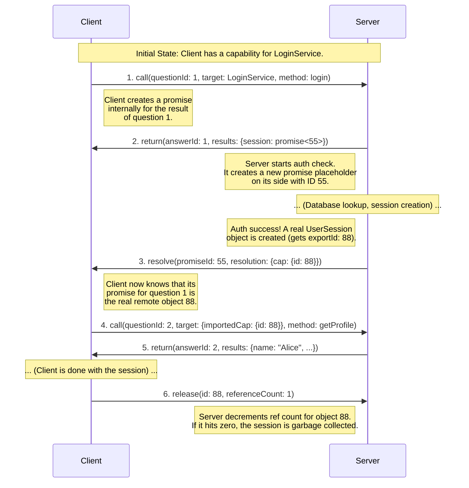
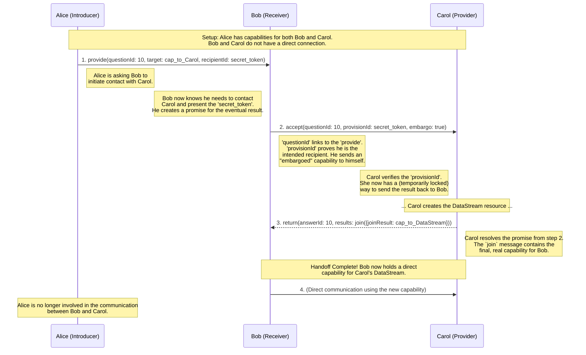
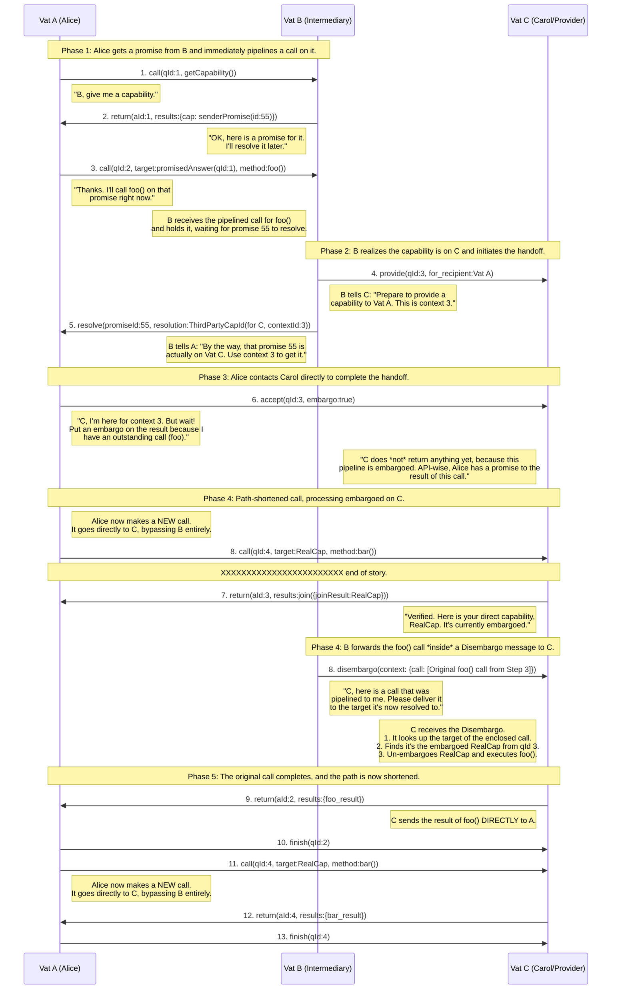

# Example promise sequence

# Example Orchestrated 3PH Sequence

# Example Promise Resolution 3PH

## The Scenario

*   **Vat A (Alice):** Our client. She wants to get a capability and immediately use it.
*   **Vat B (The Intermediary):** A service that acts as a factory or broker. It doesn't host the final capability itself.
*   **Vat C (The Provider/Carol):** The service that actually owns and hosts the final resource.

## Diagram

